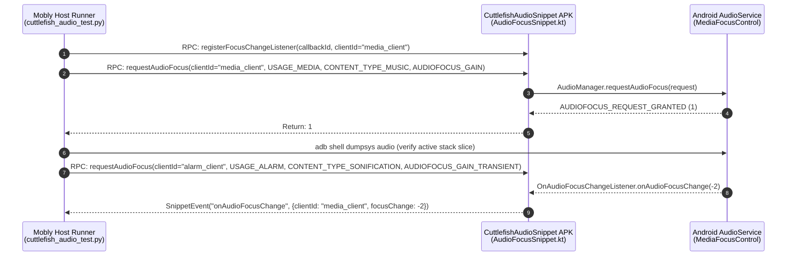

# Cuttlefish End-to-End Audio Test Suite (`cuttlefish-audio-test`)

This directory contains the Mobly end-to-end (E2E) audio validation suite and on-device JSON-RPC snippet helper app for Cuttlefish virtual devices.

---

## 1. Architecture Overview

The test suite uses the standard AOSP **Mobly + `mobly-snippet-lib`** architecture:
- **Host Runner ([`cuttlefish_audio_test.py`](cuttlefish_audio_test.py))**: Python Mobly test suite executed on the host machine via Tradefed (`MoblyBinaryHostTest`).
- **On-Device Snippet APK ([`CuttlefishAudioSnippet`](app/src/com/android/cuttlefish/audiotest/AudioFocusSnippet.kt))**: Instrumentation helper app (`com.android.cuttlefish.audiotest`) exposing Android `AudioManager` APIs over JSON-RPC (`@Rpc` and `@AsyncRpc`).
- **Per-Client State Isolation**: Every snippet RPC is keyed by an explicit `clientId: String`, allowing a single instrumentation process to simulate multiple independent audio apps requesting, losing, ducking, and regaining focus concurrently.



---

## 2. Directory Structure & Build Targets

| Path | Build Target / Role | Description |
| :--- | :--- | :--- |
| [`Android.bp`](Android.bp) | `cuttlefish-audio-test` (`python_test_host`) | Host Python test binary bundling `mobly` and `:CuttlefishAudioSnippet`. |
| [`AndroidTest.xml`](AndroidTest.xml) | Tradefed Configuration | Installs `CuttlefishAudioSnippet.apk` (`-r -g`) via `SuiteApkInstaller` and runs `MoblyBinaryHostTest` with dynamic wildcard device allocation. |
| [`cuttlefish_audio_test.py`](cuttlefish_audio_test.py) | `CuttlefishAudioFocusTest` | Data-driven Mobly test suite verifying focus acquisition, active stack state, and async callbacks. |
| [`app/Android.bp`](app/Android.bp) | `CuttlefishAudioSnippet` (`android_test_helper_app`) | On-device helper APK built against `sdk_version: "system_current"` and `mobly-snippet-lib`. |
| [`app/AndroidManifest.xml`](app/AndroidManifest.xml) | Package `com.android.cuttlefish.audiotest` | Declares `SnippetRunner` instrumentation and `mobly-snippets` metadata. |
| [`app/src/.../AudioFocusSnippet.kt`](app/src/com/android/cuttlefish/audiotest/AudioFocusSnippet.kt) | `AudioFocusSnippet` | Implements `@Rpc` and `@AsyncRpc` methods with thread-safe (`@GuardedBy("lock")`) request tracking. |

---

## 3. Snippet RPC Reference (`self.dut.audio.*`)

| Method | Type | Parameters | Return / Event Payload | Description |
| :--- | :---: | :--- | :--- | :--- |
| `requestAudioFocus` | `@Rpc` | `clientId: String`, `usage: Int`, `contentType: Int`, `focusGain: Int` | `Int` (`GRANTED=1`, `FAILED=0`, `DELAYED=2`) | Builds an `AudioFocusRequest` for `clientId`, requests focus, and appends the request to `activeRequests[clientId]`. |
| `abandonAudioFocus` | `@Rpc` | `clientId: String` | `Int` (`GRANTED=1`, `FAILED=0`) | Removes `callbackIds[clientId]` and abandons all `AudioFocusRequest` instances tracked under `clientId`. |
| `abandonAllAudioFocus` | `@Rpc` | *(none)* | `Unit` | Abandons all active `AudioFocusRequest`s across all `clientId`s and clears all registered callbacks. Called automatically in `setup_test` and `teardown_test`. |
| `registerFocusChangeListener` | `@AsyncRpc` | `callbackId: String` *(auto-injected by Mobly)*, `clientId: String` | `SnippetEvent` (`eventName="onAudioFocusChange"`) | Registers an asynchronous listener that posts `{ "clientId": String, "focusChange": Int }` whenever `onAudioFocusChange` fires for `clientId`. |
| `unregisterFocusChangeListener` | `@Rpc` | `clientId: String` | `Unit` | Removes the registered `callbackId` mapping for `clientId`. |

---

## 4. Current Test Inventory (7 Tests)

### 4.1 Data-Driven Single-Client Use-Case Matrix (`self.generate_tests`)

Each generated test in `CuttlefishAudioFocusTest`:
1. Calls `requestAudioFocus(use_case, usage, content_type, focus_gain)` and asserts `AUDIOFOCUS_REQUEST_GRANTED (1)`.
2. Slices the live `Audio Focus stack entries (last is top of stack):` section of `adb shell dumpsys audio` and asserts `com.android.cuttlefish.audiotest` is actively holding focus.
3. Calls `abandonAudioFocus(use_case)` and asserts `AUDIOFOCUS_REQUEST_GRANTED (1)`.
4. Re-checks the active `dumpsys audio` focus stack slice and asserts `com.android.cuttlefish.audiotest` has been removed.

| Test Method Name | `AudioAttributes.Usage` | `AudioAttributes.ContentType` | Focus Gain Type | Expected Result |
| :--- | :--- | :--- | :--- | :---: |
| `test_audio_focus_media` | `USAGE_MEDIA` (`1`) | `CONTENT_TYPE_MUSIC` (`2`) | `AUDIOFOCUS_GAIN` (`1`) | `GRANTED` (`1`) |
| `test_audio_focus_voice_communication` | `USAGE_VOICE_COMMUNICATION` (`2`) | `CONTENT_TYPE_SPEECH` (`1`) | `AUDIOFOCUS_GAIN_TRANSIENT` (`2`) | `GRANTED` (`1`) |
| `test_audio_focus_navigation` | `USAGE_ASSISTANCE_NAVIGATION_GUIDANCE` (`12`) | `CONTENT_TYPE_SPEECH` (`1`) | `AUDIOFOCUS_GAIN_TRANSIENT_MAY_DUCK` (`3`) | `GRANTED` (`1`) |
| `test_audio_focus_alarm` | `USAGE_ALARM` (`4`) | `CONTENT_TYPE_SONIFICATION` (`4`) | `AUDIOFOCUS_GAIN_TRANSIENT` (`2`) | `GRANTED` (`1`) |
| `test_audio_focus_notification` | `USAGE_NOTIFICATION` (`5`) | `CONTENT_TYPE_SONIFICATION` (`4`) | `AUDIOFOCUS_GAIN_TRANSIENT_MAY_DUCK` (`3`) | `GRANTED` (`1`) |
| `test_audio_focus_game` | `USAGE_GAME` (`14`) | `CONTENT_TYPE_SONIFICATION` (`4`) | `AUDIOFOCUS_GAIN` (`1`) | `GRANTED` (`1`) |

### 4.2 Multi-Client Asynchronous Callback Validation

| Test Method Name | Scenario Verified |
| :--- | :--- |
| `test_audio_focus_change_listener_callback` | Registers `@AsyncRpc` listener on `media_client` $\rightarrow$ acquires `AUDIOFOCUS_GAIN` on `media_client` $\rightarrow$ interrupts with `AUDIOFOCUS_GAIN_TRANSIENT` on `alarm_client` $\rightarrow$ verifies `media_client` receives `AUDIOFOCUS_LOSS_TRANSIENT` (`-2`) via `handler.waitAndGet('onAudioFocusChange')` $\rightarrow$ abandons `alarm_client` $\rightarrow$ verifies `media_client` receives `AUDIOFOCUS_GAIN` (`1`). |

---

## 5. Build & Run Commands

### Build & Run Full Suite via `atest`
```bash
m CuttlefishAudioSnippet cuttlefish-audio-test
ANDROID_SERIAL=<ip>:<port> atest cuttlefish-audio-test --request-upload-result
```

### Fast Test Iteration (`atest -it`)
When iterating after building `CuttlefishAudioSnippet` and `cuttlefish-audio-test`:
```bash
m CuttlefishAudioSnippet cuttlefish-audio-test
ANDROID_SERIAL=<ip>:<port> atest -it cuttlefish-audio-test --request-upload-result
```

### Run a Single Test Method
```bash
ANDROID_SERIAL=<ip>:<port> atest -it cuttlefish-audio-test:CuttlefishAudioFocusTest#test_audio_focus_change_listener_callback --request-upload-result
```

### List All Generated Mobly Tests Without Running on Device
```bash
out/host/linux-x86/testcases/cuttlefish-audio-test/x86_64/cuttlefish-audio-test --list_tests
```

---

## 6. Debugging Playbook & Common Pitfalls

### 6.1 Inspecting Live vs. Historical Audio Focus State on Device
`dumpsys audio` contains **both** the live focus stack and a rolling historical event log (`focus commands as seen by MediaFocusControl`).
- To inspect **only** the live focus stack manually:
  ```bash
  adb shell dumpsys audio | sed -n '/Audio Focus stack entries (last is top of stack):/,/ Notify on duck:/p'
  ```
- To inspect the historical focus command log:
  ```bash
  adb shell dumpsys audio | grep -A 25 "focus commands as seen by MediaFocusControl"
  ```

### 6.2 Streaming Device Logs During Test Execution
All snippet operations and callbacks log under the `AudioFocusSnippet` tag:
```bash
adb logcat -s AudioFocusSnippet:V AudioService:V MediaFocusControl:V
```

### 6.3 Locating Mobly Host & Snippet Logs After a Test Run
ATest stores full Mobly debug logs (`test_summary.yaml`, `mobly_command_log`, and per-device logcat captures) under:
```bash
ls -la /tmp/atest_result_$USER/CURRENT/log/
```

### 6.4 Key Implementation Invariants & Native Mobly Facilities
1. **Standard CLI Parsing via `<option name="no-double-dash" value="true" />`**:
   In [`AndroidTest.xml`](AndroidTest.xml), `MoblyBinaryHostTest` sets `<option name="no-double-dash" value="true" />`. This prevents Tradefed from inserting a legacy `--` separator before `--list_tests` or `--config`, allowing [`cuttlefish_audio_test.py`](cuttlefish_audio_test.py) to use pure standard `test_runner.main()` without any custom `sys.argv` munging.
2. **Targeted Per-Test Diagnostics on Failure (`logcat.Logcat` + `DUMPSYS_TARGETS`)**:
   - In `setup_class()`, `self.dut.services.register('audio_focus_logcat', logcat.Logcat, configs=logcat.Config(logcat_params='-s AudioFocusSnippet:V AudioService:V MediaFocusControl:V'))` streams filtered audio focus logs continuously.
   - In `on_fail(self, record)`, `self.dut.services.create_output_excerpts_all(self.current_test_info)` slices out the exact logcat excerpt for the failed test, and `DUMPSYS_TARGETS` captures `dumpsys audio` into `self.current_test_info.output_path` using `self.dut.generate_filename(...)`. Future streaming/routing test suites simply extend `DUMPSYS_TARGETS` with `dumpsys media.audio_flinger` and `dumpsys media.audio_policy`.
3. **Device-Scoped Structured Logging (`self.dut.log`)**:
   Use `self.dut.log.info(...)` / `self.dut.log.debug(...)` to automatically prefix log entries with `[AndroidDevice|<serial>]` in Mobly's `test_log.INFO`.
4. **Thread Concurrency in `AudioFocusSnippet.kt`**:
   `OnAudioFocusChangeListener.onAudioFocusChange` executes on Android's main looper (`Handler(Looper.getMainLooper())`), whereas `@Rpc` methods execute on `SnippetRunner` background binder/socket threads. All reads and writes to `activeRequests` and `callbackIds` must remain synchronized under `lock`.
5. **Strict Test Isolation (`setup_test` + `teardown_test`)**:
   Both `setup_test` and `teardown_test` invoke `self.dut.audio.abandonAllAudioFocus()`, and `activeRequests` stores a `MutableList<AudioFocusRequest>` per `clientId` so even repeated requests on the same `clientId` are completely abandoned between tests.
